# fido2box

[Open the recovery app](https://fido2box.dev/).

fido2box keeps a small collection of recovery secrets in encrypted box files.
Each record contains a title and ordered named fields: accounts, recovery keys,
backup codes, optional addresses and instructions. Every value can be copied;
permitted URL values are links, and hidden values require deliberate reveal. The
browser uses WebAuthn PRF to unwrap a random data key and AES-GCM to decrypt the
items. The app has no runtime dependencies or application server.

This is experimental recovery software. Read the
[security boundaries](security.md) and rehearse
[recovery and backups](recovery.md) before relying on it.

## What you can do

<!-- diagram: recovery-path -->

The file remains encrypted in storage; unlocked records live in memory. Keep a
copy outside the browser and an enrolled spare key.
[Diagram source](assets/recovery-path.mmd).

The [comparison with similar systems](comparison.md) explains how its recovery
workflow, storage, and authenticator dependencies differ from password managers.

The repository is licensed under
[Apache-2.0](https://github.com/lambdasistemi/fido2box/blob/main/LICENSE).
